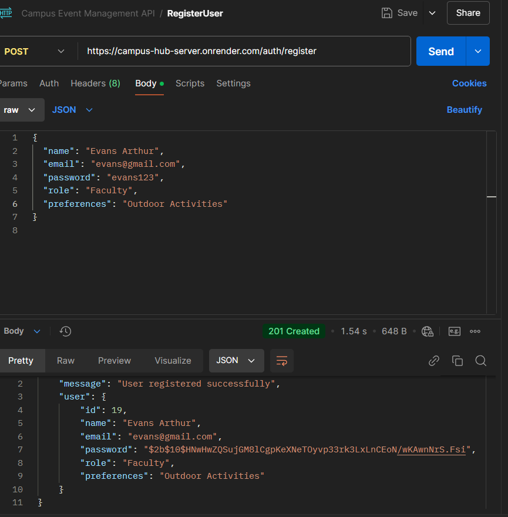
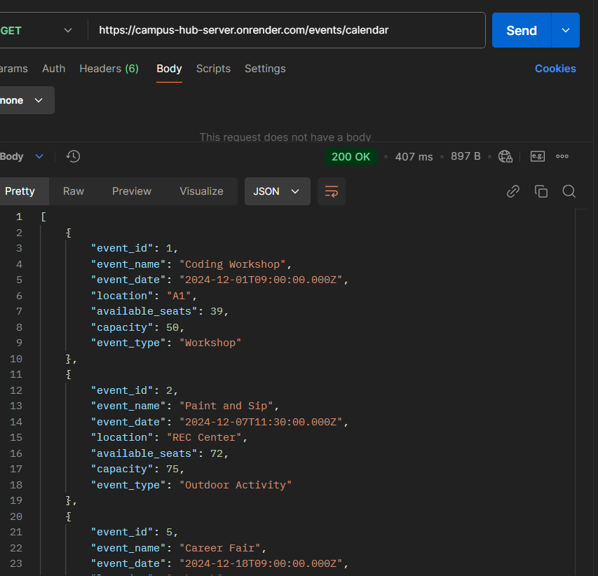
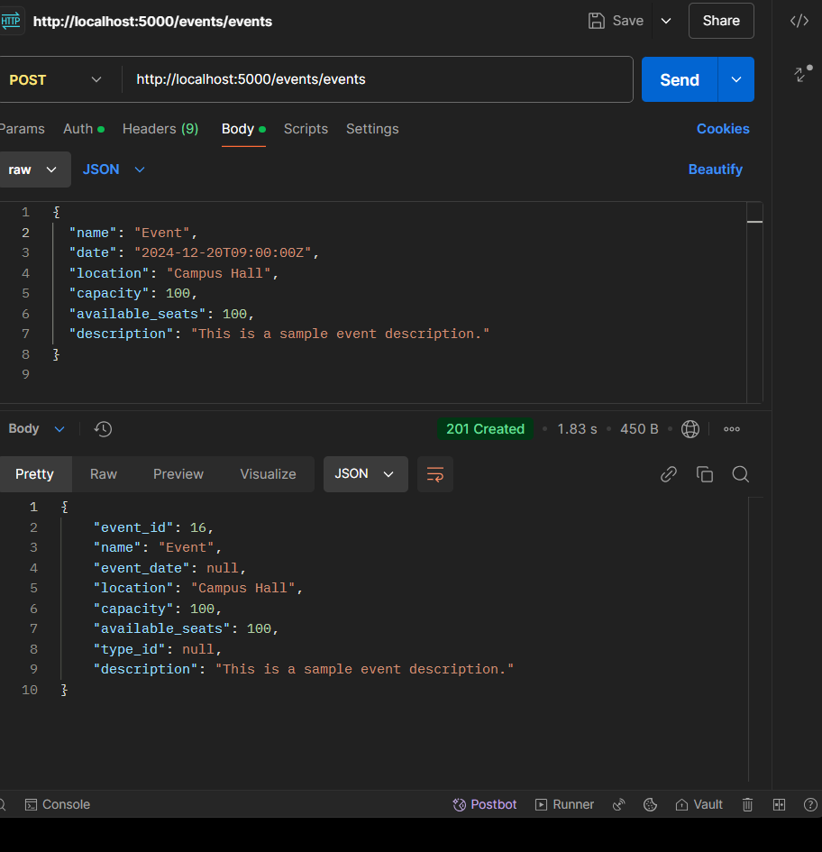
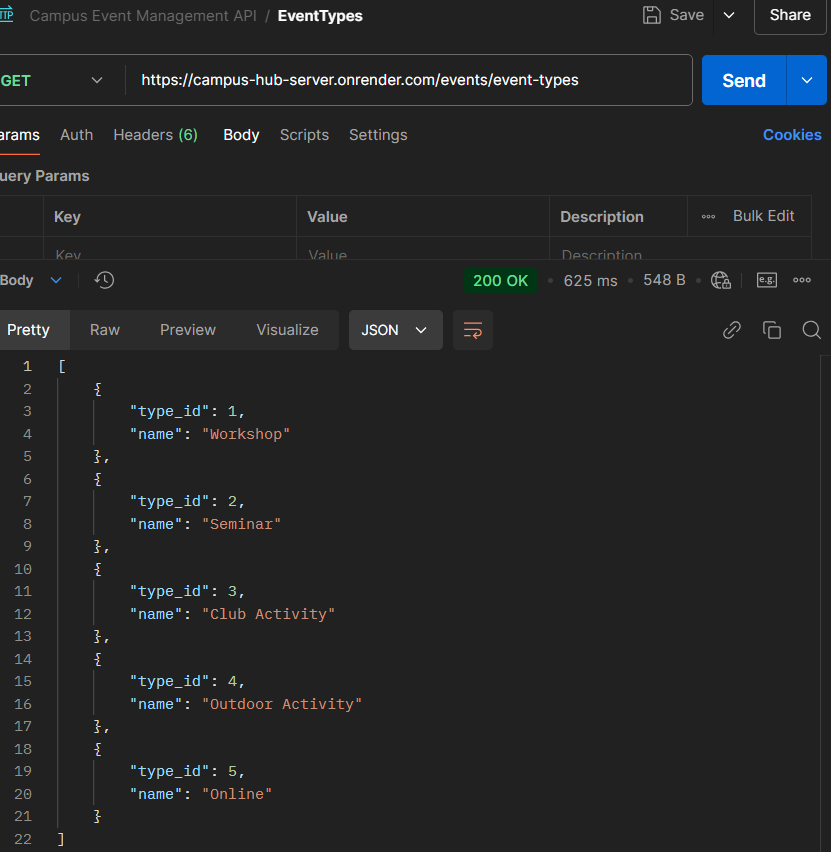
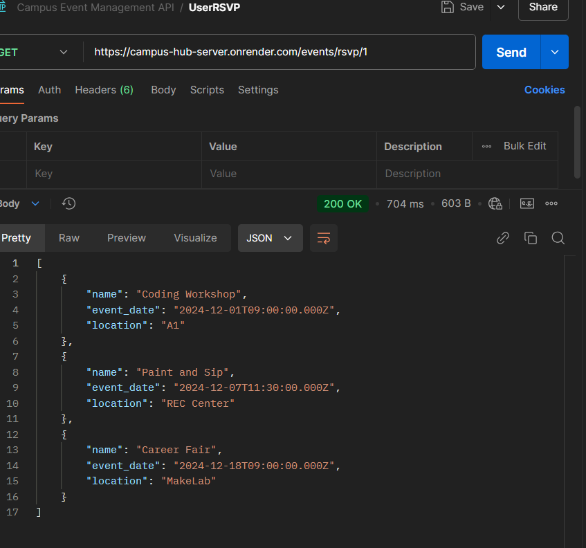
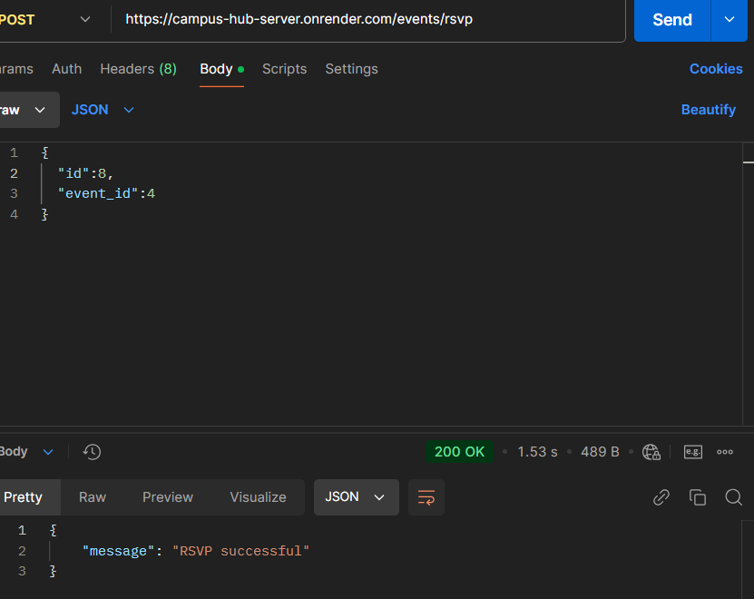

# CAMPUS HUB - Campus Events On The Go!

Welcome to the Campus Hub—a thoughtfully designed platform where campus life comes alive through events, activities, and connections! 🎉✨ Whether you’re an admin looking to organize the perfect workshop or a student eager to discover new opportunities, this system makes it all happen seamlessly.

This web app is built to empower users by making event management fun, easy, and interactive. With a user-friendly interface (and a touch of pink 😉), you can browse through campus events, RSVP to those that pique your interest, and even get to log your preferences—because we all need that little reminder on the go of the things that make campus life so exciting! 💖

With just a button, the admin has the power to create and manage events, while students and faculty can explore upcoming activities, from creative workshops to seminars, and more. The system ensures that everyone, regardless of their role, stays connected and engaged in campus life. All of this is securely handled with authentication, so you can rest assured your data stays safe while enjoying all the fun! 🌟

## Tech Stack

Frontend ✨
- React
- Tailwind CSS
Backend 💻
- Node.js
- Express
Database 💾
- PostgreSQL
- PGAdmin
Deployment 🌐
- Render
Testing Tools 🧪
- Postman
Other Tools 🛠
- Git & GitHub
- VSCode

## Acknowledgements

 - [Awesome Event Management Web App Templates](https://spot-light-appwrite.vercel.app/)
 - [Awesome README Template](https://readme.so/editor)
 
## Deployment

- GitHub Repo Link: https://github.com/MissBaduwa/Campus-Hub-Project.git

- Hosted Server Link: https://campus-hub-server.onrender.com

- Hosted Frontend Link: https://campus-hub-frontend.onrender.com

## 🔑 Login Details

To test the application, you can log in as either an Admin or a Regular User. Below are the login credentials:

Admin Login
- Username: admin@gmail.com
- Password: admin12345
The Admin has full access to manage events by being able to create and delete events.

Regular User Login
- Username: ella@gmail.com
- Password: ella123

- Username: omar@gmail.com
- Password: omar123
As a Regular User, you can browse upcoming events, filter them based on your preferences, and RSVP to the events, as weel as see all RSVP'd events on your profile page. However, you won’t be able to create or delete events.

## ✨ Feature Checklist ✨

✅ User Registration & Event Preferences
- User Sign-Up & Login 💌: Users can register (as a studentor faculty), and set their event preferences if they dont already have an account or log in if they have an existing account.
- Event Preferences 🌸: Choose which events make your heart happy! Users can input their favorite types of events.

✅ Event Listings & RSVP
- Event Listings 🎉: All events will be displayed with all the details—name, date, location, time, and how many seats are left!
- RSVP Fun 🎟️: Users can easily RSVP to an event and have realtime update of available seats.
- Event Tracking 📅: Users will always know what you’ve RSVP’d for because it would saved in the user's profile—just a tap away!
- Filter Fun 🔎: Want only the outdoor activities, workshops or seminars? Users can filter events calendar based on their preferences!

✅ Event Updates (Admin Only)
- Admin Event Creation 📝:With a button only the admin can see, the admin gets to create new events, complete with name, date, and all the other fun details like location,time, and event type!
- Event ID & Capacity 🎫: Each event gets its own unique ID, and capacity is tracked to make sure no one’s left standing!
- Admin Event Deletion 📝: A specially added feature is that admins could aslo delete events they deem as irrelevant to the general public or may have been canceled.

✅ Event Calendar View
- Calendar Magic 📅✨: All campus events in a beautiful calendar view! See everything by date with just a glance. Users can also get more details on an event from just clicking the name on the calendar.
- Filter Fun 🔎: Want only the outdoor activities, workshops or seminars? Users can filter events calendar based on their preferences!

✅ Responsive & Adorable Design
- Mobile-Friendly 📱: The web app looks cute on any device, from the phone to the desktop!
- Feminine Touch 🌸: Soft colors, rounded edges, and little sparkles everywhere with a touch of grey contrast to make it feel cozy and welcoming!

✅ Security & Privacy
- Password Protection 🔐: User passwords are safe with us—hashed securely with bcrypt to keep things locked tight!
- Role-Based Access 👑: The Admin gets special privileges, and everyone’s data is kept safe and sound.

✅ Testing & Validation
- API Testing 🔬: All the backend work is tested in Postman to ensure everything works perfectly.
- Input Validation 🛡️: No wrong info allowed—input fields are validated to keep everything clean and accurate.
## API Reference

#### User Registration
```http
    POST /auth/register
```
|Parameter    | Type	| Description                          |
| :---------- | :------ | :----------------------------------- |
|name	      | string	| Required. User's full name           |
|email	      | string	| Required. User's email address       |
|password     |	string  | Required. User's password            |
|role	      | string	| Optional. User's role (Faculty, etc.)| 
|preferences  | string	| Optional. User's preferences         |


#### User Login
```http
    POST /auth/login
```
| Parameter | Type     | Description                       |
| :-------- | :------- | :-------------------------------- |
| email     | string   | **Required**.User's email address |
| password  | string   | Required. User's password         |


#### Get all events
```http
      GET /events
```
|Parameter    | Type	| Description                               |
| :---------- | :------ | :---------------------------------------- |
|authorization| string	| Required. Bearer token for authentication |


#### Get event by ID
```http
        GET /events/:event_id
```
|Parameter    | Type	| Description                               |
| :---------- | :------ | :---------------------------------------- |
| event       | string	| Required. ID of the event to fetch        |


#### Create new event (Admin Only)
```http
     POST /events
```
|Parameter        | Type	| Description      |
| :----------     | :------ | :--------------- |
|name	          | string	| Required         |
|event_date	      | date 	| Required.        |
|location         |	string  | Required.        |
|capacity	      | int	    | Optional.        | 
|available_seats  | int 	| Optional.        |
|description      | string	| Optional.        | 
|type_id          | string	| Optional.        |


#### Delete Event (Admin Only)
```http
          DELETE /events/:event_id
```
|Parameter    | Type	| Description                               |
| :---------- | :------ | :---------------------------------------- |
| event       | string	| Required. ID of the event to fetch        |


#### RSVP to an event
```http
      POST /events/rsvp
```
| Parameter | Type     | Description                       |
| :-------- | :------- | :-------------------------------- |
| id        | string   | Required.                         |
| event_id  | string   | Required.                         |


#### Get RSVP'd events for a user
```http
          GET /events/rsvp/:id
```
|Parameter    | Type	| Description                               |
| :---------- | :------ | :---------------------------------------- |
| id          | string	| Required.                                 |


#### Get user profile
```http
      GET /users/:id
```
|Parameter    | Type	| Description                               |
| :---------- | :------ | :---------------------------------------- |
| id          | string	| Required.                                 |


#### Update User Preference
```http
      PUT /users/:id/preferences
```
| Parameter    | Type     | Description                       |
| :--------    | :------- | :-------------------------------- |
| id           | string   | Required.                         |
| preferences  | string   | Required.                         |


## API Documentation

### Screenshot of Postman API Test on Endpoints

## Testing Images

Below are some testing images used in the project:

1. 
2. 
3. 
4. 
5. 
6. 


## 🚀 How to Run This Project Locally

To run this project locally, follow these steps:

1. Clone the Repository
 First, clone this repository to your local machine using the following command in your terminal:
 ```bash 
    git clone https://github.com/MissBaduwa/Campus-Hub-Project.git
```

2. Install Dependencies
Frontend (React)
Navigate to the client folder and run:

Go to the project directory
```bash
   npm install
```
Backend (Server with PostgreSQL)
Navigate to the server folder and run:
```bash
npm install
```

 
3. Run the Database (PostgreSQL)
Make sure PostgreSQL is running locally or use a cloud service like Render for the database.

4. Start the Backend
In the server folder, run:
```bash
npm start
```

5. Start the Frontend
In the client folder, run:
```bash
npm run dev
```
Your app will be available at http://localhost:5000.

6. Test the Application
Go to http://localhost:5000 in your browser. Log in with the provided details and start using the app!


## 🌟 Lessons Learned 🌟
Building Campus Hub was an incredible learning journey filled with exciting discoveries and challenges. Here's a summary of what I learned and how I overcame the obstacles along the way:

💡 Key Learnings
🎉 Full-Stack Development Basics
I deepened my understanding of how frontend and backend systems communicate, particularly through RESTful APIs. Setting up a React frontend and integrating it with a Node.js backend taught me the importance of cohesive design and functionality.

🎉Database Management
Working with PostgreSQL and learning how to structure tables for users, events, RSVPs, and event types helped me appreciate the role of a well-designed database schema in ensuring smooth data flow.

🎉Authentication & Authorization
Implementing login systems with hashed passwords using bcrypt helped me understand the security layers required for protecting sensitive data. Setting role-based access (like Admin-only features) was an eye-opener for ensuring user-specific functionality.

🎉Frontend Styling with Tailwind CSS
Styling with Tailwind CSS allowed me to infuse the app with a touch of femininity and aesthetics while ensuring responsiveness. This balance between beauty and usability was a fun creative challenge.

🎉Event Filtering & Calendar Integration
Integrating a calendar view and implementing filtering by user preferences was a great exercise in handling dynamic data. This taught me how to manipulate datasets on the frontend to display meaningful information.

🎉Deployment Complexities
Deploying both frontend and backend services on Vercel and Render, respectively, was a huge learning experience. I encountered several hiccups with environment variables, database connection strings, and deployment processes, but eventually mastered these aspects.


🌈 Challenges Faced & Solutions
🛠CommonJS vs. ES Modules Confusion
I faced multiple errors while setting up pg for database connectivity. Switching between require and import syntax taught me about module systems in Node.js and how to adapt to project requirements.

🛠Database Connection Issues
Initial difficulties in connecting to the remote PostgreSQL database due to configurations like ECONNRESET errors were resolved by using tools like psql for troubleshooting and ensuring that environment variables were correctly set.

🛠Admin-Only Features
Restricting certain functionalities (like event creation and deletion) to admin users required careful handling of role-based conditions in the code. I solved this by incorporating logic to dynamically render admin-specific buttons and hide them from regular users.

🛠Frontend Organization
Structuring the project with organized folders for components, pages, and utilities made the development process more efficient. This organization was something I gradually refined as the project evolved.

🛠Handling Aesthetic Requests
Balancing functionality with a soft, girly aesthetic was both challenging and rewarding. Using Tailwind's customization options helped me create a design that felt unique and aligned with my 
vision.


✨ Final Takeaways
This project taught me the value of perseverance, debugging skills, and the importance of asking questions when stuck. It wasn’t always smooth sailing, but the end result—a functional, beautiful app—was worth every challenge.